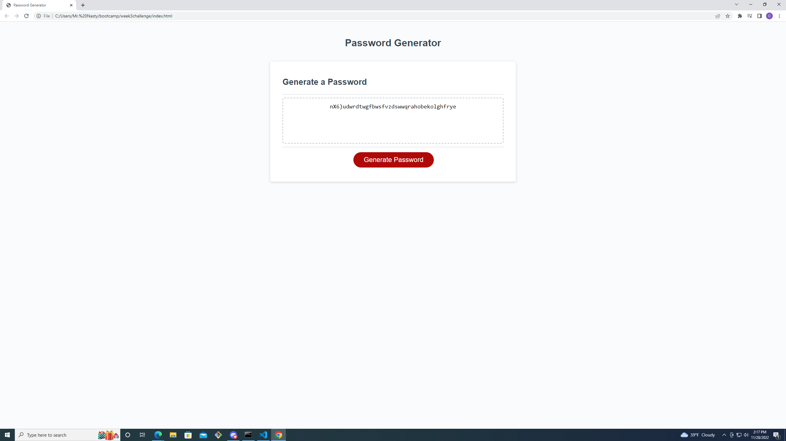

# week3challenge
JavaScript challenge for week 3

## Description

I started this project knowing that functions could be useful for generating specified criteria.  The goal of this project was to create a function and appropriate variables to make a random password generator web page.  I created a function declaring the function generate password, an array of available characters, criteria that must be met to generate a random password, and prompts to choose the criteria.  I learned that having code in a logical order really helps with understanding the steps of the function, and that having clean code really helps with debugging a webpage.

## Installation

In order to start this project I had to pull the starting code from the class Gitlab and copy the files to my local repository. After that I pushed everything to a remote repository that I had created for the project to keep everything backed up and up to date.

## Usage

active webpage link:
https://currancollins.github.io/Portfolio/

This webpage is to be used to generate a random password from 8-128 characters using atleast one criteria, choosing from lowercase, uppercase, numeric, and special characters.

